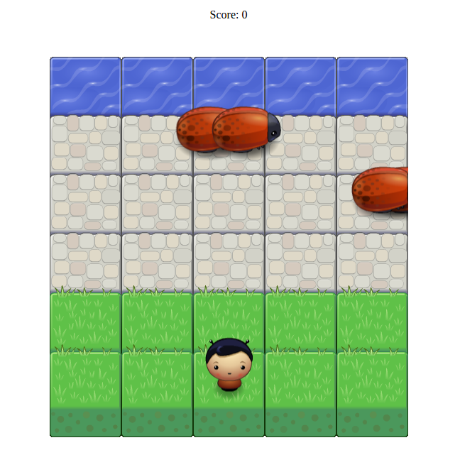

frontend-nanodegree-arcade-game
===============================

### Run the Game

To run the game, simply open the `index.html` file in a browser which supports JavaScript. You should see the play area (as shown in the image) and a score of **0**.

### Play the Game

The aim is to reach the water, avoiding collision with the bugs. Use the arrow keys to navigate around the grid. Every time you reach the water, your score increases by one.
